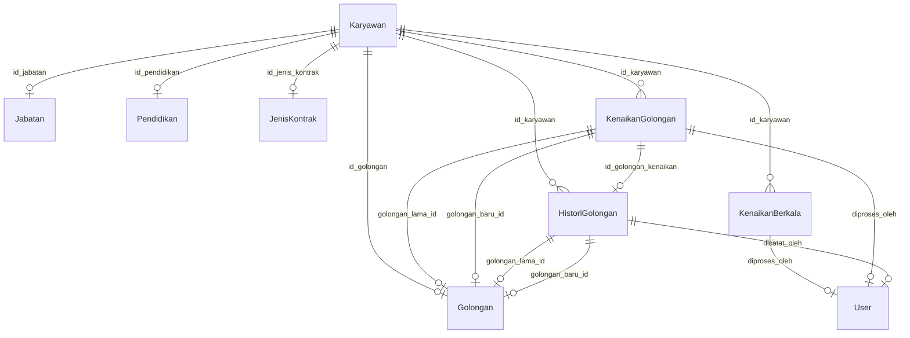
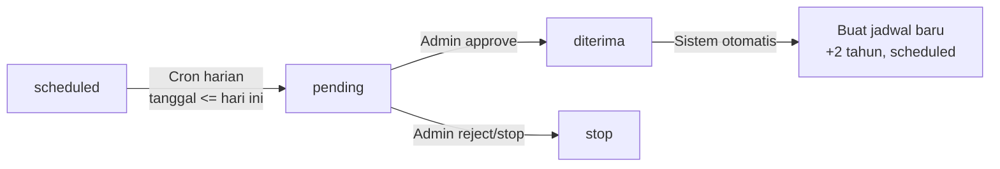
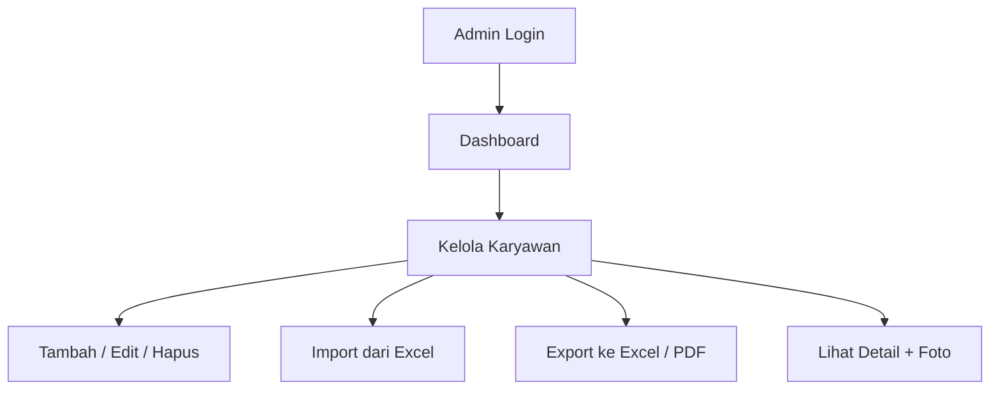
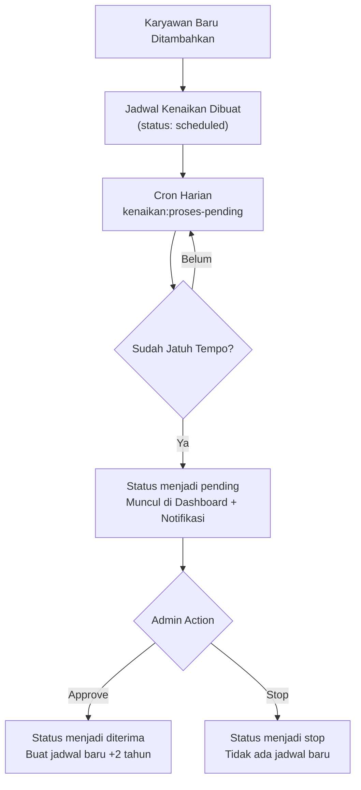
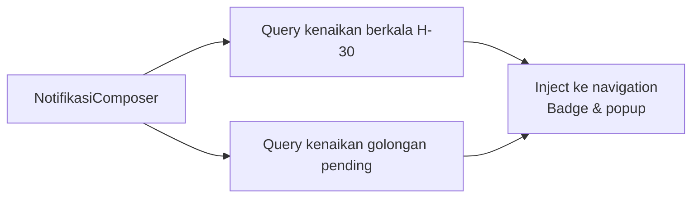

# 📋 Sistem Kepegawaian (HRIS) — Perpustakaan Daerah

> **Framework**: Laravel 13 + Blade + TailwindCSS + Alpine.js + Vite
> **PHP**: 8.3+ | **Database**: MySQL

---

## 🎯 Ringkasan Project

Project ini adalah **Sistem Informasi Kepegawaian** (Human Resource Information System / HRIS) berbasis web yang dibangun dengan Laravel. Aplikasi ini mengelola data karyawan, jabatan, golongan, jenis kontrak, pendidikan, serta **kenaikan berkala (gaji)** dan **kenaikan golongan** secara otomatis melalui sistem scheduler/cron.

---

## 🏗️ Arsitektur & Teknologi

| Layer | Teknologi | Keterangan |
|---|---|---|
| **Backend** | Laravel 13.8 | PHP framework MVC |
| **Frontend** | Blade + Alpine.js | Server-side rendering + reaktif ringan |
| **Styling** | TailwindCSS 3 + `@tailwindcss/forms` | Utility-first CSS |
| **Build Tool** | Vite 8 | Asset bundling (CSS/JS) |
| **Autentikasi** | Laravel Breeze | Login, register, forgot password |
| **Export Excel** | `spatie/simple-excel` | Export/import data karyawan via XLSX |
| **Export PDF** | `barryvdh/laravel-dompdf` | Generate PDF profil karyawan |
| **Database** | MySQL | Relational database |
| **Testing** | Pest 4 | PHP testing framework |

---

## 🚀 Instalasi & Setup

### Prasyarat

- PHP >= 8.3
- Composer
- Node.js >= 18 & npm
- MySQL

### Langkah Instalasi

```bash
# 1. Clone repository
git clone <repository-url>
cd website-new

# 2. Install dependensi PHP
composer install

# 3. Salin file environment
cp .env.example .env

# 4. Generate application key
php artisan key:generate

# 5. Konfigurasi database di .env
#    Sesuaikan DB_DATABASE, DB_USERNAME, DB_PASSWORD

# 6. Jalankan migration & seeder
php artisan migrate --seed

# 7. Buat symlink storage
php artisan storage:link

# 8. Install dependensi Node.js
npm install

# 9. Build assets
npm run build
```

### Menjalankan Development Server

```bash
# Cara cepat (semua sekaligus: server, queue, logs, vite)
composer dev

# Atau manual satu per satu:
php artisan serve          # Laravel server
npm run dev                # Vite dev server
php artisan queue:listen   # Queue worker
```

### Setup Cron Job (Production)

```bash
crontab -e
# Tambahkan baris ini:
* * * * * cd /path-to-project && php artisan schedule:run >> /dev/null 2>&1
```

### Generate Notifikasi Manual (Opsional)

```bash
# Generate notifikasi kenaikan untuk H-1 s/d H-30
php artisan tinker --execute="\App\Models\NotifikasiKenaikan::generateRange(); echo 'Done';"
```

---

## 📁 Struktur Folder — Penjelasan Detail

### 🔷 Root Files (File Konfigurasi)

| File | Fungsi |
|---|---|
| `composer.json` | Mendefinisikan dependensi PHP (Laravel, Breeze, DomPDF, dll) dan script automasi |
| `package.json` | Mendefinisikan dependensi Node.js (Vite, Tailwind, Alpine.js) |
| `vite.config.js` | Konfigurasi Vite — menentukan entry point CSS/JS |
| `tailwind.config.js` | Konfigurasi TailwindCSS — font Figtree, scan file Blade |
| `.env` | Konfigurasi environment (database, mail, cache, session) |
| `phpunit.xml` | Konfigurasi test runner |
| `postcss.config.js` | PostCSS pipeline (autoprefixer) |

---

### 🔷 `app/` — Logika Utama Aplikasi

Folder ini mengikuti pola **MVC** (Model-View-Controller) dari Laravel.

---

#### 📦 `app/Models/` — Data & Relasi Database

Setiap model merepresentasikan 1 tabel di database dan mendefinisikan relasi antar tabel.

| Model | Tabel | Fungsi |
|---|---|---|
| `Karyawan.php` | `karyawans` | **Model utama** — menyimpan data karyawan (NIP, NIK, nama, gender, tanggal lahir/masuk, alamat, agama, foto, status aktif). Berelasi ke jabatan, pendidikan, kontrak, golongan, kenaikan berkala, dan kenaikan golongan |
| `Jabatan.php` | `jabatans` | Master data jabatan (nama jabatan) |
| `Pendidikan.php` | `pendidikans` | Master data pendidikan (nama pendidikan + jenjang) |
| `JenisKontrak.php` | `jenis_kontraks` | Master data jenis kontrak (nama kontrak + jam kerja per hari) |
| `Golongan.php` | `golongans` | Master data golongan (tipe: PNS/PPPK, nama golongan misal I/A, II/B) |
| `KenaikanBerkala.php` | `kenaikan_berkalas` | Jadwal kenaikan gaji berkala tiap 2 tahun. Status: `scheduled → pending → diterima/stop` |
| `KenaikanGolongan.php` | `kenaikan_golongans` | Jadwal kenaikan golongan/pangkat. Saat approve: update golongan karyawan + catat histori |
| `HistoriGolongan.php` | `histori_golongans` | Riwayat permanen setiap kali karyawan naik golongan (audit trail) |
| `NotifikasiKenaikan.php` | `notifikasi_kenaikans` | Notifikasi H-30 sebelum tanggal kenaikan (gaji/jabatan). Di-generate via scheduler |
| `User.php` | `users` | User admin yang login ke sistem |

##### Diagram Relasi (ERD):



---

#### 🎮 `app/Http/Controllers/` — Logika Request/Response

| Controller | Fungsi |
|---|---|
| `DashboardController.php` | Halaman utama setelah login. Menampilkan statistik: total karyawan, distribusi per jabatan/pendidikan/kontrak/gender, status PNS/PPPK/Outsourcing, karyawan terbaru, kenaikan berkala & golongan yang upcoming |
| `KaryawanController.php` | **CRUD lengkap** data karyawan + export Excel, export PDF (massal & single), import Excel, upload/hapus foto, download template |
| `GolonganController.php` | CRUD master data golongan (PNS/PPPK) |
| `JabatanController.php` | CRUD master data jabatan |
| `PendidikanController.php` | CRUD master data pendidikan + API endpoint cascading dropdown |
| `JenisKontrakController.php` | CRUD master data jenis kontrak |
| `KenaikanBerkalaController.php` | Daftar kenaikan berkala pending, approve (buat jadwal +2 tahun), reject/stop |
| `KenaikanGolonganController.php` | Daftar kenaikan golongan pending, approve (update golongan + histori), reject/stop |
| `KenaikanController.php` | Landing page / hub halaman kenaikan |
| `ProfileController.php` | Edit profil user yang login (nama, email, password) |
| `Auth/` (folder) | Controller bawaan Laravel Breeze untuk login, register, forgot password, verifikasi email |

---

#### 📤 `app/Exports/` & 📥 `app/Imports/` — Excel Export/Import

| File | Fungsi |
|---|---|
| `KaryawanExport.php` | Export data karyawan ke file XLSX dengan filter (status, jabatan, kontrak, golongan). Menggunakan `Spatie\SimpleExcel` |
| `KaryawanImport.php` | Import data karyawan dari XLSX. Fitur: normalisasi header kolom (fleksibel), parsing tanggal multi-format (termasuk Excel serial number), lookup relasi otomatis, `updateOrCreate` berdasarkan NIP |

---

#### 🔔 `app/View/Composers/` — Inject Data ke View

| File | Fungsi |
|---|---|
| `NotifikasiComposer.php` | **Otomatis** inject data notifikasi kenaikan (berkala H-30 + golongan pending) ke semua halaman yang menggunakan `layouts.navigation`. Sehingga badge/popup notifikasi selalu tersedia di navbar |

Didaftarkan di `AppServiceProvider.php`:
```php
View::composer('layouts.navigation', NotifikasiComposer::class);
```

---

#### ⏰ `app/Console/Commands/` — Artisan Command (Cron Job)

| File | Fungsi |
|---|---|
| `ProsesPendingKenaikan.php` | Command `kenaikan:proses-pending` — dijalankan harian via cron. Mengubah status kenaikan yang sudah jatuh tempo dari `scheduled` → `pending` agar muncul di halaman approval admin |

##### Alur Status Kenaikan:



---

#### 🎨 `app/View/Components/` — Blade Components Class

| File | Fungsi |
|---|---|
| `AppLayout.php` | Component class untuk layout utama (authenticated) |
| `GuestLayout.php` | Component class untuk layout guest (login/register) |

---

### 🔷 `routes/` — Definisi URL

| File | Fungsi |
|---|---|
| `web.php` | **Route utama**: Dashboard, Profile, CRUD master data (pendidikan, jabatan, kontrak, golongan), CRUD karyawan + export/import, kenaikan berkala/golongan. Semua dilindungi middleware `auth` + `verified` |
| `auth.php` | Route autentikasi dari Laravel Breeze: register, login, forgot/reset password, verifikasi email, logout |

##### Ringkasan Endpoint:

| URL | Method | Fungsi |
|---|---|---|
| `/` | GET | Welcome page |
| `/dashboard` | GET | Dashboard statistik |
| `/karyawan` | CRUD | Kelola data karyawan |
| `/karyawan/export/excel` | GET | Download Excel |
| `/karyawan/export/pdf` | GET | Download PDF massal |
| `/karyawan/{id}/export-pdf` | GET | Download PDF single |
| `/karyawan/import` | POST | Upload & import Excel |
| `/karyawan/template` | GET | Download template Excel |
| `/pendidikan` | CRUD | Master pendidikan |
| `/jabatan` | CRUD | Master jabatan |
| `/kontrak` | CRUD | Master jenis kontrak |
| `/golongan` | CRUD | Master golongan |
| `/kenaikan` | GET | Landing page kenaikan |
| `/kenaikan-berkala` | GET | List pending kenaikan berkala |
| `/kenaikan-berkala/{id}/approve` | POST | Approve kenaikan berkala |
| `/kenaikan-golongan` | GET | List pending kenaikan golongan |
| `/kenaikan-golongan/{id}/approve` | POST | Approve kenaikan golongan |

---

### 🔷 `resources/views/` — Tampilan (Blade Templates)

| Folder/File | Fungsi |
|---|---|
| `layouts/` | Template induk: `app.blade.php` (layout utama), `guest.blade.php` (halaman login/register), `navigation.blade.php` (navbar + sidebar + popup notifikasi) |
| `components/` | 15 reusable Blade component: button, dropdown, modal, form-field, searchable-select, dll |
| `dashboard.blade.php` | Halaman dashboard — chart, statistik, tabel karyawan terbaru |
| `welcome.blade.php` | Landing page / halaman awal |
| `karyawan/` | 6 views: index (list+filter), create, edit, show (detail), pdf.blade.php (PDF massal), pdf-single.blade.php (PDF per karyawan) |
| `golongan/` | 3 views: index, create, edit |
| `jabatan/` | Views untuk CRUD jabatan |
| `pendidikan/` | Views untuk CRUD pendidikan |
| `kontrak/` | Views untuk CRUD jenis kontrak |
| `kenaikan/` | Landing page hub kenaikan |
| `kenaikan-berkala/` | List + approval kenaikan berkala |
| `kenaikan-golongan/` | List + approval kenaikan golongan |
| `profile/` | Edit profil user |
| `auth/` | Login, register, forgot password (dari Breeze) |

---

### 🔷 `database/` — Skema & Data Awal

#### Migrations (Struktur Tabel)

| Migration | Tabel yang Dibuat |
|---|---|
| `0001_01_01_000000_create_users_table` | `users`, `password_reset_tokens`, `sessions` |
| `0001_01_01_000001_create_cache_table` | `cache`, `cache_locks` |
| `0001_01_01_000002_create_jobs_table` | `jobs`, `job_batches`, `failed_jobs` |
| `2026_05_16_061000_create_master_tables` | `pendidikans`, `jabatans`, `jenis_kontraks`, `golongans` |
| `2026_05_16_070000_create_karyawans_table` | `karyawans` (tabel utama karyawan) |
| `2026_06_01_000001_create_kenaikan_tables` | `kenaikan_berkalas`, `kenaikan_golongans`, `histori_golongans` |
| `2026_06_18_084628_add_jenjang` | Tambah kolom `jenjang` ke `pendidikans` |
| `2026_06_18_160000_restructure_pendidikan` | Pindahkan `nama_pendidikan` ke tabel karyawan |
| `2026_06_25_065734_change_jenjang` | Ubah tipe `jenjang` dari enum ke string |

#### Seeders (Data Awal)

| Seeder | Fungsi |
|---|---|
| `DatabaseSeeder.php` | Memanggil semua seeder lainnya |
| `GolonganSeeder.php` | Isi data golongan PNS & PPPK |
| `JabatanSeeder.php` | Isi data jabatan contoh |
| `JenisKontrakSeeder.php` | Isi data jenis kontrak contoh |
| `KaryawanSeeder.php` | Isi data karyawan dummy |
| `PendidikanSeeder.php` | Isi data pendidikan contoh |

---

### 🔷 `resources/css/` & `resources/js/` — Frontend Assets

| File | Fungsi |
|---|---|
| `resources/css/app.css` | Entry point CSS — di-compile Vite bersama TailwindCSS |
| `resources/js/app.js` | Entry point JS — inisialisasi Alpine.js |

---

### 🔷 `config/` — Konfigurasi Laravel

| File | Fungsi |
|---|---|
| `dompdf.php` | Konfigurasi library DomPDF (ukuran kertas, font, dll) |
| `app.php`, `auth.php`, `cache.php`, `database.php`, `filesystems.php`, `logging.php`, `mail.php`, `queue.php`, `services.php`, `session.php` | Konfigurasi standar Laravel |

---

### 🔷 `public/` — File Statis (Accessible dari Browser)

| Item | Fungsi |
|---|---|
| `index.php` | Entry point utama — semua request masuk lewat sini |
| `image/logo.png` | Logo aplikasi |
| `build/` | Hasil compile Vite (CSS/JS production) |
| `storage/` | Symlink ke `storage/app/public` (foto karyawan, dll) |
| `.htaccess` | Rewrite rule Apache |

---

### 🔷 Folder Pendukung Lainnya

| Folder | Fungsi |
|---|---|
| `bootstrap/` | Bootstrap framework Laravel (cache autoload) |
| `storage/` | Tempat penyimpanan file: logs, cache, session, upload foto karyawan |
| `tests/` | File test menggunakan Pest |
| `vendor/` | Dependensi PHP (auto-generate oleh Composer, **jangan diedit**) |

---

## 🔄 Alur Kerja Utama Aplikasi

### 1. Manajemen Karyawan



### 2. Sistem Kenaikan Otomatis



### 3. Notifikasi



---

## 📊 Ringkasan Fitur

| Fitur | Status |
|---|---|
| ✅ Login/Register/Forgot Password | Laravel Breeze |
| ✅ Dashboard dengan statistik & chart | Chart per jabatan, pendidikan, kontrak, gender |
| ✅ CRUD Karyawan (lengkap) | + upload foto, filter, search |
| ✅ CRUD Master Data | Jabatan, Pendidikan, Golongan, Jenis Kontrak |
| ✅ Export ke Excel | Dengan filter |
| ✅ Import dari Excel | Normalisasi otomatis |
| ✅ Export ke PDF | Massal & per karyawan |
| ✅ Download template Excel | Untuk import |
| ✅ Kenaikan Berkala Otomatis | Scheduler + approval |
| ✅ Kenaikan Golongan | Dengan histori & audit trail |
| ✅ Notifikasi Kenaikan | H-30, badge di navbar |
| ✅ Cron Job | `kenaikan:proses-pending` |

---

## 📄 Lisensi

MIT License
